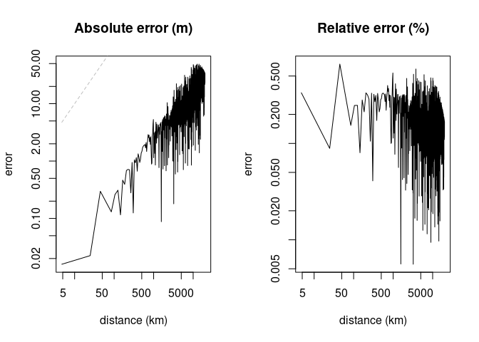

<!-- README.md is generated from README.Rmd. Please edit that file -->

[](https://travis-ci.org/hypertidy/geodist)
[](http://www.repostatus.org/#wip)
[](https://codecov.io/gh/hypertidy/geodist)
[](http://cran.r-project.org/web/packages/geodist)


# geodist

An ultra-lightweight, zero-dependency package for very fast calculation
of geodesic distances.

## Installation

You can install geodist from github with:

``` r
# install.packages("devtools")
devtools::install_github("hypertidy/geodist")
```

## Usage

`geodist` contains only one eponymous function which accepts only one or
two primary arguments, each of which must be some kind of rectangular
object with unambiguously labelled longitude and latitude columns (that
is, some variant of `lon`/`lat`, or `x`/`y`).

``` r
library(geodist)
```

``` r
# current verison
packageVersion("geodist")
#> [1] '0.0.0.9000'
```

Input can be in arbtirary rectangular format.

``` r
n <- 1e1
x <- tibble::tibble (x = -180 + 360 * runif (n),
                     y = -90 + 180 * runif (n))
dim (geodist (x))
#> [1] 10 10
y <- tibble::tibble (x = -180 + 360 * runif (2 * n),
                     y = -90 + 180 * runif (2 * n))
dim (geodist (x, y))
#> [1] 10 20
x <- cbind (-180 + 360 * runif (n),
             -90 + 100 * runif (n),
             seq (n), runif (n))
colnames (x) <- c ("lon", "lat", "a", "b")
dim (geodist (x))
#> [1] 10 10
```

Distances currently implemented are Haversine, Vincenty (spherical), and
the very fast [mapbox cheap
ruler](https://github.com/mapbox/cheap-ruler-cpp/blob/master/include/mapbox/cheap_ruler.hpp)
(see their [blog
post](https://blog.mapbox.com/fast-geodesic-approximations-with-cheap-ruler-106f229ad016)).
These are determined by the `measure` parameter which takes one of
`"haversine"`, `"vincenty"`, or `"cheap"`.

It is also possible to calculate sequential distances along the rows of
a rentangular object:

``` r
d <- geodist (x, measure = "vincenty", sequential = TRUE)
nrow (x); length (d)
#> [1] 10
#> [1] 9
d <- geodist (x, measure = "vincenty", sequential = TRUE, pad = TRUE)
nrow (x); length (d); head (d)
#> [1] 10
#> [1] 10
#>          [,1]
#> [1,]       NA
#> [2,] 10959720
#> [3,]  4278914
#> [4,]  8746226
#> [5,]  5729448
#> [6,]  5478099
```

The `pad` argument pre-pends an `NA` to return a vector commensurate
with input dimensions, and so able to be used directly in piped `dplyr`
operations.

### Comparison

Geodesic distance calculation is available in the [`sf`
package](https://cran.r-project.org/package=sf), requiring only
conversion of sets of numeric lon-lat points to `sf` form with the
following code:

``` r
require (magrittr)
#> Loading required package: magrittr
x_to_sf <- function (x)
{
    sapply (seq (nrow (x)), function (i)
            sf::st_point (x [i, ]) %>%
                sf::st_sfc ()) %>%
    sf::st_sfc (crs = 4326)
}
```

Note that the relevant function, `sf::st_distance()` calculates geodesic
distances using the methods developed by [Karney
(2013)](https://link.springer.com/content/pdf/10.1007/s00190-012-0578-z.pdf),
also provided in this package through internally-bundled code (available
[here](https://geographiclib.sourceforge.io/geod.html)).

``` r
n <- 1e3
x <- cbind (-180 + 360 * runif (n), -90 + 180 * runif (n))
colnames (x) <- c ("x", "y")
xsf <- x_to_sf (x)
sf_dist <- function (x) sf::st_distance (x, x)
geo_dist <- function (x) geodist (x, measure = "geodesic")
rbenchmark::benchmark (replications = 10, order = "test",
                      sf_dist (xsf),
                      geo_dist (x)) [, 1:4]
#> Linking to GEOS 3.6.2, GDAL 2.3.0, proj.4 5.0.1
#>           test replications elapsed relative
#> 2  geo_dist(x)           10   5.325    1.000
#> 1 sf_dist(xsf)           10  15.477    2.906
```

Confirm that the two give almost identical results:

``` r
ds <- matrix (as.numeric (sf_dist (xsf)), nrow = length (xsf))
dg <- geodist (x, measure = "geodesic")
formatC (max (abs (ds - dg)), format = "e")
#> [1] "1.3039e-08"
```

All results are in metres, so the two differ by only around 10
nanometres.

The [`geosphere` package](https://cran.r-project.org/package=geosphere)
also offers sequential calculation which is benchmarked with the
following
code:

``` r
fgeodist <- function () geodist (x, measure = "vincenty", sequential = TRUE)
fgeosph <- function () geosphere::distVincentySphere (x)
rbenchmark::benchmark (replications = 10, order = "test",
                       fgeodist (),
                       fgeosph ()) [, 1:4]
#>         test replications elapsed relative
#> 1 fgeodist()           10   0.005      1.0
#> 2  fgeosph()           10   0.006      1.2
```

The [mapbox cheap ruler
algorithm](https://github.com/mapbox/cheap-ruler-cpp) provides
approximate yet very fast distance calculations within small (typically
intra-urban) areas. Speed advantages are demonstrated in the following
code:

``` r
n <- 1e3
dx <- dy <- 0.01
x <- cbind (-100 + dx * runif (n), 20 + dy * runif (n))
y <- cbind (-100 + dx * runif (2 * n), 20 + dy * runif (2 * n))
colnames (x) <- colnames (y) <- c ("x", "y")
rbenchmark::benchmark (replications = 10, order = "test",
                       d1 <- geodist (x, measure = "cheap"),
                       d2 <- geodist (x, measure = "haversine"),
                       d3 <- geodist (x, measure = "vincenty"),
                       d4 <- geodist (x, measure = "geodesic")) [, 1:4]
#>                                      test replications elapsed relative
#> 1     d1 <- geodist(x, measure = "cheap")           10   0.113    1.000
#> 2 d2 <- geodist(x, measure = "haversine")           10   0.173    1.531
#> 3  d3 <- geodist(x, measure = "vincenty")           10   0.232    2.053
#> 4  d4 <- geodist(x, measure = "geodesic")           10   3.091   27.354
```

Finally, what everybody probably most wants to know … Is the extra time
to calculate highly accurate geodesic distances really worthwhile? The
answer depends of course on the scale of distances involved, but the
following graph provides a visual aid to answering this question.



The mapbox cheap ruler algorithm is actually even more accurate than
Vincenty for distances below a few hundred kilometres, beyond which it
becomes extremely inaccurate. Average relative errors of Vincenty
distances remain generally constant at around 0.2%.

### Test Results

``` r
require (devtools)
require (testthat)
```

``` r
date()
#> [1] "Fri Jun 29 10:56:40 2018"
devtools::test("tests/")
#> Loading geodist
#> Testing geodist
#> ✔ | OK F W S | Context
✖ | 39       | geodist [0.1 s]
#> 
#> ══ Results ════════════════════════════════════════════════════════════════
#> Duration: 0.2 s
#> 
#> OK:       39
#> Failed:   0
#> Warnings: 0
#> Skipped:  0
```
