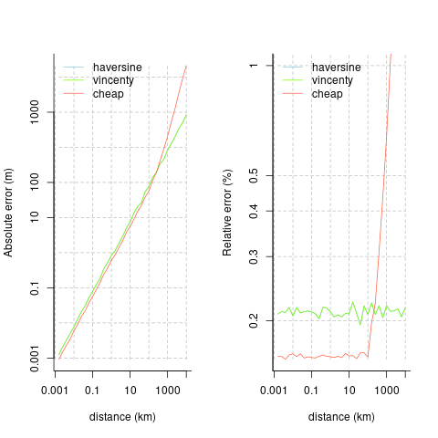

```{r pkg-load, echo = FALSE, message = FALSE, eval = FALSE}
devtools::load_all (".", export_all = FALSE)
```

# geodist

An ultra-lightweight, zero-dependency package for very fast calculation of
geodesic distances. Main eponymous function, `geodist()`, accepts only one or
two primary arguments, which must be rectagular objects with unambiguously
labelled longitude and latitude columns (that is, some variant of `lon`/`lat`,
or `x`/`y`).
```{r intro, eval = FALSE}
n <- 50
x <- cbind (-10 + 20 * runif (n), -10 + 20 * runif (n))
y <- cbind (-10 + 20 * runif (2 * n), -10 + 20 * runif (2 * n))
colnames (x) <- colnames (y) <- c ("x", "y")
d0 <- geodist (x) # A 50-by-50 matrix
d1 <- geodist (x, y) # A 50-by-100 matrix
d2 <- geodist (x, sequential = TRUE) # Vector of length 49
d2 <- geodist (x, sequential = TRUE, pad = TRUE) # Vector of length 50
```


## Detailed Usage

Input(s) to the `geodist()` function can be in arbitrary rectangular format.

```{r tibble, eval = FALSE}
n <- 1e1
x <- tibble::tibble (x = -180 + 360 * runif (n),
                     y = -90 + 180 * runif (n))
dim (geodist (x))
#> [1] 10 10
y <- tibble::tibble (x = -180 + 360 * runif (2 * n),
                     y = -90 + 180 * runif (2 * n))
dim (geodist (x, y))
#> [1] 10 20
x <- cbind (-180 + 360 * runif (n),
             -90 + 100 * runif (n),
             seq (n), runif (n))
colnames (x) <- c ("lon", "lat", "a", "b")
dim (geodist (x))
#> [1] 10 10
```
Distances currently implemented are Haversine, Vincenty (spherical), the very
fast [mapbox cheap
ruler](https://github.com/mapbox/cheap-ruler-cpp/blob/master/include/mapbox/cheap_ruler.hpp)
(see their [blog
post](https://blog.mapbox.com/fast-geodesic-approximations-with-cheap-ruler-106f229ad016)),
and the "reference" implementation of [Karney
(2013)](https://link.springer.com/content/pdf/10.1007/s00190-012-0578-z.pdf), as
implemented in the package [`sf`](https://cran.r-project.org/package=sf). (Note
that `geodist` does not accept
[`sf`](https://cran.r-project.org/package=sf)-format objects; the
[`sf`](https://cran.r-project.org/package=sf) package itself should be used for
that.) Note that The [mapbox cheap ruler
algorithm](https://github.com/mapbox/cheap-ruler-cpp) is intended to provide
approximate yet very fast distance calculations within small areas (typically
the size of single cities or study sites).


### Benchmarks of geodetic accuracy

The `geodist_benchmark()` function - the only other function provided by the
`geodist` package - compares the accuracy of the different metrics to the
nanometre-accuracy standard of [Karney
(2013)](https://link.springer.com/content/pdf/10.1007/s00190-012-0578-z.pdf).
```{r geodist_benchmark, eval = FALSE}
geodist_benchmark (lat = 30, d = 1000)
#>            haversine    vincenty       cheap
#> absolute 0.836551561 0.836551562 0.594188257
#> relative 0.002155514 0.002155514 0.001616718
```
All distances (`d)` are in metres, so that result indicates that all measures
are accurate to within 1m over distances out to several km. The following plots
compare the absolute and relative accuracies of the different distance measures
implemented here.  The mapbox cheap ruler algorithm is the most accurate for
distances out to around 100km, beyond which it becomes extremely inaccurate.
Average relative errors of Vincenty distances remain generally constant at
around 0.2%, while relative errors of cheap-ruler distances out to 100km are
around 0.16%.


```{r plot, eval = FALSE, echo = FALSE}
lat <- 30
d <- 10 ^ (1:35 / 5) # 1m to 100 km
y <- lapply (d, function (i) geodist_benchmark (lat = lat, d = i))
yabs <- do.call (rbind, lapply (y, function (i) i [1, ])) [, c (1, 2, 4)]
yrel <- 100 * do.call (rbind, lapply (y, function (i) i [2, ])) [, c (1, 2, 4)]

yvals <- list (yabs, yrel)
cols <- c ("skyblue", "lawngreen", "tomato")
par (mfrow = c (1, 2))
ylabs <- c ("Absolute error (m)", "Relative error (%)")
ylims <- list (range (yvals [[1]]), c (min (yvals [[2]]), 1))
for (i in 1:2)
{
    plot (NULL, NULL, xlim = range (d / 1000), ylim = ylims [[i]],
          bty = "l", log = "xy", xaxt = "n", yaxt = "n",
          xlab = "distance (km)", ylab = ylabs [i])
    axis (d / 1000, side = 1, at = c (0.001, 0.1, 10, 1e3, 1e4),
          labels = c ("0.001", "0.1", "10", "1000", ""))
    if (i == 1)
    {
        yl <- 10 ^ (-3:5)
        axis (yvals [[i]], side = 2, at = c (0.001, 0.1, 10, 100, 10000),
              labels = c ("0.001", "0.1", "10", "100", "1000"))
    } else
    {
        yl <- c (0.1, 0.2, 0.3, 0.4, 0.5, 1, 2)
        axis (yvals [[i]], side = 2, at = yl, 
              labels = c ("0.1", "0.2", "0.3", "0.4", "0.5", "1", "2"))
    }
    junk <- sapply (yl, function (j)
                    lines (range (d / 1000), rep (j, 2),
                           col = "grey", lty = 2))

    xl <- 10 ^ (-3:6)
    junk <- sapply (xl, function (j)
                    lines (rep (j, 2), range (yvals [[i]]),
                           col = "grey", lty = 2))

    for (j in 1:3)
        lines (d / 1000, yvals [[i]] [, j], col = cols [j])
    legend ("topleft", lwd = 1, col = cols, bty = "n",
            legend = colnames (yvals [[i]]))
}
```



### Performance comparison

The following code demonstrates the relative speed advantages of the different
distance measures implemented in the `geodist` package.
```{r benchmark-measures, eval = FALSE}
n <- 1e3
dx <- dy <- 0.01
x <- cbind (-100 + dx * runif (n), 20 + dy * runif (n))
y <- cbind (-100 + dx * runif (2 * n), 20 + dy * runif (2 * n))
colnames (x) <- colnames (y) <- c ("x", "y")
rbenchmark::benchmark (replications = 10, order = "test",
                       d1 <- geodist (x, measure = "cheap"),
                       d2 <- geodist (x, measure = "haversine"),
                       d3 <- geodist (x, measure = "vincenty"),
                       d4 <- geodist (x, measure = "geodesic")) [, 1:4]
#>                                      test replications elapsed relative
#> 1     d1 <- geodist(x, measure = "cheap")           10   0.058    1.000
#> 2 d2 <- geodist(x, measure = "haversine")           10   0.185    3.190
#> 3  d3 <- geodist(x, measure = "vincenty")           10   0.276    4.759
#> 4  d4 <- geodist(x, measure = "geodesic")           10   3.106   53.552
```

Geodesic distance calculation is available in the [`sf`
package](https://cran.r-project.org/package=sf). Comparing computation speeds
requires conversion of sets of numeric lon-lat points to `sf` form with the
following code:
```{r x_to_sf, eval = FALSE}
require (magrittr)
x_to_sf <- function (x)
{
    sapply (seq (nrow (x)), function (i)
            sf::st_point (x [i, ]) %>%
                sf::st_sfc ()) %>%
    sf::st_sfc (crs = 4326)
}
```

```{r benchmark-sf, eval = FALSE}
n <- 1e2
x <- cbind (-180 + 360 * runif (n), -90 + 180 * runif (n))
colnames (x) <- c ("x", "y")
xsf <- x_to_sf (x)
sf_dist <- function (x) sf::st_distance (x, x)
geo_dist <- function (x) geodist (x, measure = "geodesic")
rbenchmark::benchmark (replications = 10, order = "test",
                      sf_dist (xsf),
                      geo_dist (x)) [, 1:4]
#> Linking to GEOS 3.6.2, GDAL 2.3.0, proj.4 5.0.1
#>           test replications elapsed relative
#> 2  geo_dist(x)           10   0.066    1.000
#> 1 sf_dist(xsf)           10   0.210    3.182
```

Confirm that the two give almost identical results:
```{r benchmark-sf-accuracy, eval = FALSE}
ds <- matrix (as.numeric (sf_dist (xsf)), nrow = length (xsf))
dg <- geodist (x, measure = "geodesic")
formatC (max (abs (ds - dg)), format = "e")
#> [1] "7.4506e-09"
```
All results are in metres, so the two differ by only around 10 nanometres.

The [`geosphere` package](https://cran.r-project.org/package=geosphere) also
offers sequential calculation which is benchmarked with the following code:
```{r, echo = FALSE}
n <- 1e4
x <- cbind (-180 + 360 * runif (n), -90 + 180 * runif (n))
colnames (x) <- c ("x", "y")
```
```{r sequential, eval = FALSE}
fgeodist <- function () geodist (x, measure = "vincenty", sequential = TRUE)
fgeosph <- function () geosphere::distVincentySphere (x)
rbenchmark::benchmark (replications = 10, order = "test",
                       fgeodist (),
                       fgeosph ()) [, 1:4]
#>         test replications elapsed relative
#> 1 fgeodist()           10   0.022    1.000
#> 2  fgeosph()           10   0.048    2.182
```
